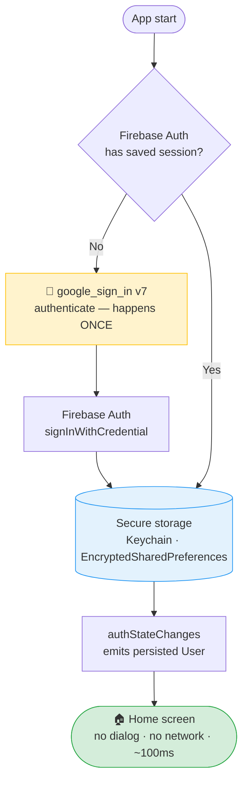

# Google Sign-In v7 + Firebase Auth: The Session Persistence Solution

> **The architectural approach that actually works when Android kills your app**

[](https://flutter.dev/)
[](https://pub.dev/packages/google_sign_in)
[](https://pub.dev/packages/firebase_auth)
[]()

---

## 🔥 The Problem

You've migrated to **Google Sign-In v7**. Everything works... until Android kills your app to free memory.

**What happens:**
1. ✅ User signs in with Google
2. ✅ Uses app normally for days/weeks
3. 💀 Android kills app (memory cleanup)
4. 📱 User reopens app
5. ❌ **User is logged out** - must re-authenticate

**Impact:**
- 😤 Users frustrated by constant re-login
- 📉 Retention rates drop
- 📊 Metrics become unreliable (anonymous vs real users)
- 💔 App feels broken

Sound familiar?

---

## ❌ Why "Common Solutions" Don't Work

### Attempt 1: `attemptLightweightAuthentication()`
```dart
await _googleSignIn.attemptLightweightAuthentication();
```
**Result:** ❌ Always shows UI - not silent

### Attempt 2: Manual Token Caching
```dart
final prefs = await SharedPreferences.getInstance();
await prefs.setString('google_token', token);
```
**Result:** ❌ Complex, fragile, tokens expire

### Attempt 3: "Official v7 Patterns"
```dart
_googleSignIn.authenticationEvents.listen(...)
```
**Result:** ❌ Loses "remember user", creates more problems

---

## 💡 The Insight

**Stop fighting Google Sign-In v7.**

> **Google Sign-In is the key to open the front door.  
> Firebase Auth is the house where you live.**

### The Architecture



### ❌ vs ✅ — The critical difference

| ❌ Don't | ✅ Do | Why |
|---------|------|-----|
| `attemptLightweightAuthentication()` on startup | Listen to `authStateChanges` | LWA always shows UI — it is not silent |
| Cache email in `SharedPreferences` | Trust `Firebase.currentUser` | SharedPreferences stores display data, not auth sessions |
| Check `_googleSignIn.currentUser` on cold start | Check `_auth.currentUser` | google_sign_in.currentUser is **always null** after app kill in v7 |
| Call `Firebase.initializeApp()` after `runApp()` | Call it in `main()` before `runApp()` | AuthProvider constructor runs before Firebase is ready — stream never fires |
| Sync user to Firestore for "persistence" | Nothing — Firebase Auth already persists | Firestore stores data, not auth sessions. It's duplicated work |


---

## ✅ The Solution

### Core Concept

**On app startup, check Firebase Auth FIRST** - not Google Sign-In:

```dart
Future<void> initializeAuth() async {
  final existingUser = FirebaseAuth.instance.currentUser;
  
  if (existingUser != null && !existingUser.isAnonymous) {
    // 🎉 AUTO-LOGIN SUCCESS
    // Firebase maintained the session
    print('✅ Welcome back: ${existingUser.email}');
  } else {
    // No real user, create anonymous session
    await FirebaseAuth.instance.signInAnonymously();
  }
}
```

**That's it.** Firebase Auth automatically persists. You're done.

---

## 🚀 Quick Start

### 1. Install Dependencies

```yaml
dependencies:
  firebase_core: ^4.1.1
  firebase_auth: ^6.1.0
  google_sign_in: ^7.2.0
  provider: ^6.1.1
```

### 2. Initialize Firebase

```dart
void main() async {
  WidgetsFlutterBinding.ensureInitialized();
  
  await Firebase.initializeApp(
    options: DefaultFirebaseOptions.currentPlatform,
  );
  
  runApp(MyApp());
}
```

### 3. Implement AuthProvider

See [`example/lib/providers/auth_provider.dart`](example/lib/providers/auth_provider.dart) for complete implementation.

**Key method:**

```dart
class AuthProvider extends ChangeNotifier {
  Future<void> initializeAuth() async {
    final existingUser = _authService.currentUser;
    
    if (existingUser != null && !existingUser.isAnonymous) {
      // User already logged in - auto-login successful
      print('✅ Auto-login: ${existingUser.displayName}');
    } else {
      await _authService.signInAnonymously();
    }
  }
}
```

### 4. Implement AuthService

See [`example/lib/services/auth_service.dart`](example/lib/services/auth_service.dart) for complete implementation.

**Google Sign-In becomes simple:**

```dart
Future<UserCredential?> signInWithGoogle() async {
  await _googleSignIn.initialize(
    serverClientId: 'YOUR_WEB_CLIENT_ID',
  );
  
  final googleUser = await _googleSignIn.authenticate(
    scopeHint: ['email']
  );
  
  final googleAuth = googleUser.authentication;
  final credential = GoogleAuthProvider.credential(
    idToken: googleAuth.idToken
  );
  
  return await FirebaseAuth.instance.signInWithCredential(credential);
}
```

### 5. Wire Up Your App

```dart
class MyApp extends StatelessWidget {
  @override
  Widget build(BuildContext context) {
    return ChangeNotifierProvider(
      create: (_) => AuthProvider(),
      child: MaterialApp(
        home: AuthWrapper(),
      ),
    );
  }
}

class AuthWrapper extends StatefulWidget {
  @override
  _AuthWrapperState createState() => _AuthWrapperState();
}

class _AuthWrapperState extends State<AuthWrapper> {
  @override
  void initState() {
    super.initState();
    WidgetsBinding.instance.addPostFrameCallback((_) {
      context.read<AuthProvider>().initializeAuth();
    });
  }

  @override
  Widget build(BuildContext context) {
    return Consumer<AuthProvider>(
      builder: (context, authProvider, _) {
        if (authProvider.isLoading) {
          return LoadingScreen();
        }
        
        return authProvider.isLoggedIn 
          ? HomePage() 
          : LoginPage();
      },
    );
  }
}
```

---

## 🎯 Results

### Before (with Google Sign-In v7 default behavior):
- ❌ Users logged out after app killed
- ❌ Users forced to re-authenticate every time Android killed the app
- ❌ Metrics unreliable

### After (with this solution):
- ✅ **Automatic silent login** after app killed
- ✅ **Zero user friction** - they never see a login screen
- ✅ **Real user tracking** - accurate metrics
- ✅ **Production tested** for 1 year

---

## 📚 Why This Works

### Firebase Auth Persists Automatically

From [Firebase documentation](https://firebase.google.com/docs/auth/flutter/start):

> "On native platforms such as Android & iOS, this behavior is not configurable and the user's authentication state will be persisted on device between app restarts."

### Google Sign-In v7 Does NOT

From Google Flutter team ([see QUOTES.md](docs/QUOTES.md)):

> "google_sign_in 7.x does not have a silent login option, specifically because some platforms—including Android—do not provide an option in the currently supported authentication SDKs that will guarantee silent sign in."

### The Solution

**Use Firebase Auth for what it's good at (persistence) and Google Sign-In for what it's designed for (initial authentication).**

Stop trying to sync two systems. Use one.

---

## 📖 Full Documentation

- **[QUOTES.md](docs/QUOTES.md)** - Official statements from Google Flutter team
- **[ARCHITECTURE.md](docs/ARCHITECTURE.md)** - Deep dive into the solution
- **[PROBLEM.md](docs/PROBLEM.md)** - Detailed problem analysis
- **[example/](example/)** - Complete working demo app

---

## 🤝 Contributing

Found this helpful? Here's how you can help:

1. ⭐ **Star this repo** - Helps others discover it
2. 🐛 **Report issues** - If you find edge cases
3. 💬 **Share your experience** - Open a discussion
4. 🔀 **Submit PRs** - Improvements welcome

---

## 📝 License

MIT License - See [LICENSE](LICENSE) file for details.

---

## 🙏 Acknowledgments

This solution was developed and battle-tested in production for **QuehaCeMos Córdoba**, a cultural events app serving users in Córdoba, Argentina.

**Special thanks to:**
- The Flutter community for extensive debugging help
- Google Flutter team for transparent communication about v7 limitations
- All developers who reported and discussed this issue on GitHub

---

## ⚡ TL;DR

**Problem:** Google Sign-In v7 loses session when Android kills app  
**Solution:** Use Firebase Auth as single source of truth  
**Result:** Automatic silent re-login that actually works

**Check Firebase Auth on startup, not Google Sign-In.**

That's the whole trick.

---

**Built with ❤️ in Córdoba, Argentina**

*Production tested since May 2025*
